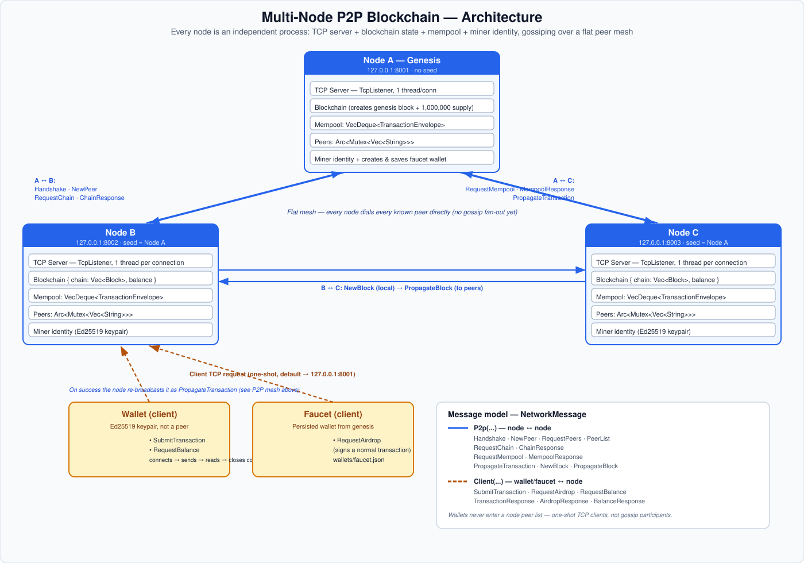

# Rust Blockchain & P2P Network

A blockchain built from scratch in Rust, with Proof of Work, signed transactions, a mempool, persistent wallets, and a TCP-based peer-to-peer network.

The project is intentionally implemented without relying on an existing blockchain framework. The goal is to understand how the major pieces of a blockchain work together: blocks, transactions, balances, wallets, mining, networking, synchronization, and command-line interaction.

> **Current status:** The project currently supports a working multi-node TCP network, transaction and block propagation, wallet-to-node communication, wallet persistence, mempool synchronization, and basic fork handling with chain synchronization. Advanced fork resolution/chain-selection is still a future step.

---

## Features

### Blockchain

- Genesis block creation with an initial supply.
- SHA-256 block hashing.
- Proof of Work with configurable nonce difficulty.
- Previous-hash chaining.
- Block validation.
- Transaction validation while applying blocks.
- Deterministic state reconstruction from the chain.
- Miner block rewards and transaction-fee rewards.
- Mempool with transaction-ID based duplicate detection.
- Removal of mined transactions from the mempool.

### Transactions and wallets

- Ed25519 key generation.
- Transaction signing.
- Transaction IDs generated with SHA-256.
- Signature verification.
- Balance checking before a transaction enters the mempool.
- Wallet save/load functionality using JSON.
- Separate faucet wallet persisted to `wallets/faucet.json`.
- Wallet-to-node communication over TCP.

### P2P networking

- TCP server for every node.
- Multi-threaded connection handling with `thread::spawn`.
- `Arc<Mutex<...>>` shared node state.
- Peer handshakes.
- Peer discovery and peer-list propagation.
- Chain synchronization.
- Mempool synchronization.
- Transaction propagation.
- Block propagation.
- Client-to-node request/response messages for wallet operations.

### CLI

The project currently exposes three roles:

```text
node
wallet
faucet
```

Each role has its own interactive command loop.

---

## Architecture

The project has three main kinds of processes: **nodes** (peers in a flat TCP mesh), **wallets** (one-shot clients), and the **faucet** (a persisted wallet created at genesis).



Every node runs the same binary and owns its own copy of the chain, mempool, peer list, and miner identity — there is no central server. Wallets and the faucet are deliberately *not* peers: they open a TCP connection to one node, send a single `ClientMessage`, read the response, and close the connection, exactly as shown above.

### Node

A node owns:

- its blockchain state,
- its mempool,
- a list of peers,
- a miner identity,
- a TCP server.

The node validates transactions and blocks and propagates valid data to peers.

### Wallet

A wallet owns a public/private keypair.

It:

- creates and signs transactions,
- connects to a node only when it needs to perform an operation,
- sends a request over TCP,
- receives a response,
- closes the connection.

A wallet is **not** a P2P peer.

### Faucet

The faucet is a persisted wallet created during genesis-node startup.

It behaves like a normal wallet and creates signed transactions for airdrops. The node receives those transactions and puts them into the mempool.

---

## Message Model

All TCP messages are wrapped in:

```rust
NetworkMessage
```

with two categories:

```text
NetworkMessage::P2p(...)
NetworkMessage::Client(...)
```

### Node-to-node messages

The current P2P protocol contains messages for:

- `Handshake`
- `NewPeer`
- `RequestPeers`
- `PeerList`
- `RequestChain`
- `ChainResponse`
- `RequestMempool`
- `MempoolResponse`
- `PropagateTransaction`
- `NewBlock`
- `PropagateBlock`

### Wallet/faucet-to-node messages

The client protocol currently supports:

- `SubmitTransaction`
- `RequestAirdrop`
- `RequestBalance`
- transaction responses
- airdrop responses
- balance responses

This separation keeps wallet requests out of the node's peer list: wallets are clients, not P2P peers.

---

## Project Structure

The project is organized roughly as follows:

```text
src/
├── balances.rs       # Account balances and transfers
├── block.rs          # Block and Blockchain implementations
├── hash.rs           # SHA-256 hashing and Proof of Work
├── helper.rs         # Logging setup and CLI banners
├── main.rs           # Application entry point
├── message.rs        # P2P and client network messages
├── miner.rs          # Proof-of-Work mining logic
├── node.rs           # Node networking, synchronization and CLI
├── transaction.rs    # Transactions, signatures and validation
└── wallet.rs         # Wallets, signing, persistence and wallet CLI
```

Generated runtime directories:

```text
logs/
└── node_<port>.log

wallets/
├── faucet.json
├── alice.json
└── ...
```

---

## Prerequisites

Install Rust and Cargo.

Check:

```bash
rustc --version
cargo --version
```

Then clone the repository and build it:

```bash
git clone <your-repository-url>
cd <your-project-directory>
cargo build
```

---

## Configuration

The blockchain reads these configuration values from environment variables:

```text
PER_TX_REWARD
MAX_TX_PER_BLOCK
NONCE_DIFFICULTY
FEES_PERCENT
```

The source code reads them using `std::env::var`, so they must be available in the process environment.

### Linux / macOS

```bash
export PER_TX_REWARD=50
export MAX_TX_PER_BLOCK=5
export NONCE_DIFFICULTY=4
export FEES_PERCENT=1
```

### PowerShell

```powershell
$env:PER_TX_REWARD="50"
$env:MAX_TX_PER_BLOCK="5"
$env:NONCE_DIFFICULTY="4"
$env:FEES_PERCENT="1"
```

Choose values appropriate for your machine. A higher `NONCE_DIFFICULTY` makes Proof of Work substantially more expensive.

---

# Running the Project

The executable supports three roles:

```text
cargo run node ...
cargo run wallet ...
cargo run faucet
```

## 1. Start the genesis node

Open Terminal 1:

```bash
cargo run -- node 8001
```

A node started without a seed is the genesis node.

It:

- creates the genesis block,
- creates the initial supply,
- creates the faucet wallet,
- saves the faucet wallet to:

```text
wallets/faucet.json
```

The current implementation initializes the genesis supply to:

```text
1,000,000
```

The node then starts its interactive CLI:

```text
node>
```

---

## 2. Start another node

Open Terminal 2:

```bash
cargo run -- node 8002 127.0.0.1:8001
```

This node starts with an empty blockchain and uses `8001` as its seed node.

It then:

1. starts its TCP server,
2. handshakes with the seed,
3. discovers peers,
4. requests the current blockchain,
5. validates the received chain,
6. rebuilds its balances,
7. requests the current mempool.

You should eventually see the same chain height on both nodes.

---

## 3. Start a third node

Open Terminal 3:

```bash
cargo run -- node 8003 127.0.0.1:8001
```

You can use another already-connected node as the seed as well.

For example:

```bash
cargo run -- node 8003 127.0.0.1:8002
```

---

# Node CLI

Once a node is running:

```text
node>
```

### `help`

Show available commands.

```text
node> help
```

### `info`

Show a node summary:

```text
node> info
```

The command displays:

- chain height,
- mempool size,
- peer count,
- latest block index,
- latest block hash,
- miner address.

### `chain`

Display the blocks currently stored by the node:

```text
node> chain
```

### `peers`

Display connected peers:

```text
node> peers
```

### `mempool`

Display all transactions currently waiting to be mined:

```text
node> mempool
```

### `mine`

Mine a new block from the current mempool:

```text
node> mine
```

The node:

1. selects valid transactions,
2. constructs a block,
3. performs Proof of Work,
4. validates and adds the mined block,
5. removes mined transactions from the mempool,
6. broadcasts the block to peers.

### `exit`

Stop the node:

```text
node> exit
```

---

# Wallet CLI

## Create a wallet

```bash
cargo run -- wallet new
```

This creates a new Ed25519 keypair and starts the wallet CLI:

```text
wallet>
```

Check its address:

```text
wallet> info
```

The public key is displayed as a hexadecimal string.

> The private key is also currently displayed by `info`. This is convenient for development, but it should not be done in a production wallet.

---

## Save a wallet

Inside the wallet CLI:

```text
wallet> save alice
```

This creates:

```text
wallets/alice.json
```

---

## Load a wallet

Later:

```bash
cargo run -- wallet load alice
```

The program loads:

```text
wallets/alice.json
```

and starts the wallet CLI using the same keypair.

---

## Check balance

```text
wallet> balance
```

The wallet:

1. connects to the default node,
2. sends its public key,
3. asks for the balance,
4. receives a response,
5. closes the TCP connection.

The default node is:

```text
127.0.0.1:8001
```

A different node can be supplied:

```text
wallet> balance 127.0.0.1:8002
```

---

## Send a transaction

Syntax:

```text
wallet> send <amount> <receiver_public_key> [node_address]
```

Example:

```text
wallet> send 100 <receiver-public-key>
```

or:

```text
wallet> send 100 <receiver-public-key> 127.0.0.1:8002
```

The wallet:

1. constructs the transaction,
2. signs it,
3. calculates its transaction ID,
4. sends the signed transaction to one node,
5. waits for a response.

The node then validates it and, if valid, puts it in the mempool and propagates it to peers.

---

# Faucet

The genesis node creates and persists the faucet wallet:

```text
wallets/faucet.json
```

Start the faucet CLI with:

```bash
cargo run -- faucet
```

Then:

```text
faucet>
```

### Request an airdrop

```text
faucet> airdrop <amount> <receiver_public_key>
```

Example:

```text
faucet> airdrop 500 <wallet-public-key>
```

Optionally specify a node:

```text
faucet> airdrop 500 <wallet-public-key> 127.0.0.1:8002
```

The faucet creates a normal signed transaction and submits it to the selected node.

The transaction then follows the normal lifecycle:

```text
Faucet
  ↓
Node
  ↓
Mempool
  ↓
P2P propagation
  ↓
Miner
  ↓
Block
  ↓
P2P block propagation
  ↓
All synchronized nodes
```

An airdrop is therefore not a special balance mutation: it is represented by a normal transaction.

---

# Example: Complete Multi-Node Test

The easiest way to demonstrate the project is to run three nodes, one faucet, and one wallet.

## Terminal 1 — Genesis node

```bash
cargo run -- node 8001
```

## Terminal 2 — Node B

```bash
cargo run -- node 8002 127.0.0.1:8001
```

## Terminal 3 — Node C

```bash
cargo run -- node 8003 127.0.0.1:8001
```

## Terminal 4 — Create a wallet

```bash
cargo run -- wallet new
```

Inside the wallet:

```text
wallet> info
```

Copy the public key.

Save it:

```text
wallet> save alice
```

## Terminal 5 — Start faucet

```bash
cargo run -- faucet
```

Request tokens:

```text
faucet> airdrop 1000 <alice-public-key>
```

At this point the transaction should propagate through the P2P network.

Check the nodes:

```text
node> mempool
```

The transaction should be visible on synchronized peers.

## Mine the transaction

On any node that has the transaction in its mempool:

```text
node> mine
```

The resulting block is broadcast to the network.

Check:

```text
node> info
```

and:

```text
node> chain
```

on the other nodes.

Finally:

```text
wallet> balance
```

should report the updated balance.

---

# Transaction Lifecycle

A normal transaction follows this path:

```text
Wallet
  │
  │ signed TransactionEnvelope
  ▼
Node
  │
  ├── verify signature
  ├── verify balance
  └── insert into mempool
  │
  ▼
P2P propagation
  │
  ▼
Other node mempools
  │
  ▼
Miner selects transactions
  │
  ▼
Proof of Work
  │
  ▼
NewBlock
  │
  ▼
Block validation
  │
  ├── previous hash
  ├── block hash
  ├── Proof of Work
  ├── transaction validity
  └── miner reward
  │
  ▼
Blockchain state update
  │
  ▼
Mined transaction removed from mempool
```

---

# Chain Synchronization

When a new node joins the network it can start with an empty blockchain.

The synchronization flow is:

```text
Joining Node
     │
     │ RequestChain
     ▼
Seed / Peer
     │
     │ ChainResponse
     ▼
Joining Node
     │
     ├── validate chain
     ├── rebuild balances
     ├── replace local chain/state
     ├── recover transactions from divergent blocks
     └── request mempool
```

The current implementation also supports:

- recovery of transactions from blocks that are no longer part of the selected local chain,
- mempool requests/responses,
- requesting a chain again when a received block does not extend the current chain.

The project still does **not** implement a complete production-grade fork-selection/consensus protocol.

---

# Persistence

### Wallet persistence

Wallets are persisted as JSON:

```text
wallets/alice.json
wallets/bob.json
wallets/faucet.json
```

Wallet persistence is currently available through:

```text
wallet> save <name>
```

and:

```bash
cargo run -- wallet load <name>
```

### Blockchain persistence

The `Blockchain` implementation contains JSON save/load functions for the chain.

The current CLI does not expose dedicated `save` and `load` node commands, so blockchain persistence is available through the underlying Rust API rather than the current interactive node CLI.

---

# Logging

Node background activity is written using `tracing`.

For example, a node listening on port `8001` writes:

```text
logs/node_8001.log
```

The terminal is reserved mainly for interactive CLI output, while networking and background events are recorded in the log file.

This keeps the node CLI readable while still providing detailed debugging information.

---

# Security / Design Notes

This project is educational and intentionally simplified.

### Cryptography

Transactions are signed using Ed25519 and hashed using SHA-256.

### Wallet storage

Private keys are currently stored directly in JSON files.

For a real wallet this would need encrypted key storage and secure secret handling.

### Networking

Communication currently uses plain TCP and JSON serialization.

There is no TLS, authentication, rate limiting, or DoS protection.

### Consensus

The project uses Proof of Work, but its chain-selection and fork handling are still simplified compared with production blockchains.

### Faucet

The faucet is implemented as a persisted wallet that signs ordinary transactions.

---

# Current Implementation vs Future Work

## Implemented

- [x] Wallet generation
- [x] Ed25519 transaction signatures
- [x] Transaction IDs
- [x] Transaction validation
- [x] Mempool
- [x] Proof of Work
- [x] Mining rewards
- [x] Transaction fees
- [x] Genesis block
- [x] Block validation
- [x] State reconstruction
- [x] Wallet persistence
- [x] TCP node server
- [x] Peer discovery
- [x] Transaction propagation
- [x] Block propagation
- [x] Basic chain synchronization
- [x] Mempool synchronization
- [x] Wallet-to-node TCP communication
- [x] Faucet wallet and airdrops
- [x] Interactive node/wallet/faucet CLIs
- [x] File-based node logging

## Planned / Future Improvements

- [ ] Background mining thread
- [ ] More efficient incremental chain synchronization
- [ ] Robust fork detection and chain selection
- [ ] Chain reorganization
- [ ] More complete transaction-history support
- [ ] Stronger network security
- [ ] Encrypted wallet storage
- [ ] Graphical frontend / blockchain explorer
- [ ] More extensive integration and networking tests

---

# Why This Project?

The project is designed to understand the systems behind a blockchain rather than only implementing a data structure.

The main areas covered are:

```text
Cryptography
     +
Data Structures
     +
Proof of Work
     +
Concurrency
     +
TCP Networking
     +
Peer-to-Peer Systems
     +
State Management
     +
Persistence
```

The interesting part of the project is the interaction between these components: a wallet creates a signed transaction, nodes validate and gossip it, miners include it in a Proof-of-Work block, nodes validate the block, update their state, synchronize with peers, and keep their mempools consistent.

---

## Suggested Demo

A good live demonstration is:

1. Start three nodes.
2. Connect them through the seed-node mechanism.
3. Create/load a wallet.
4. Request an airdrop.
5. Show the transaction appearing in multiple mempools.
6. Mine a block on one node.
7. Show the block arriving on the other nodes.
8. Query the wallet balance.
9. Start a fresh node and watch it synchronize the chain and mempool.

This demonstrates the core distributed behavior of the project end-to-end.
